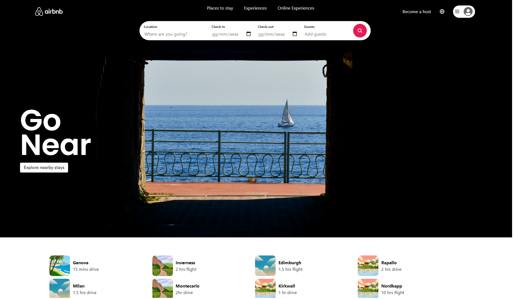
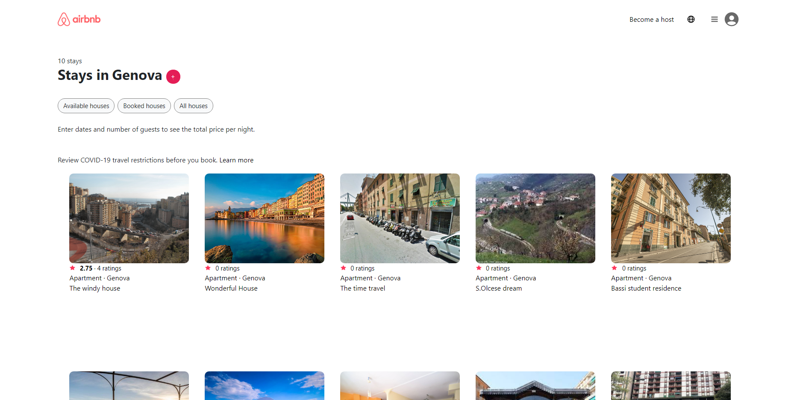
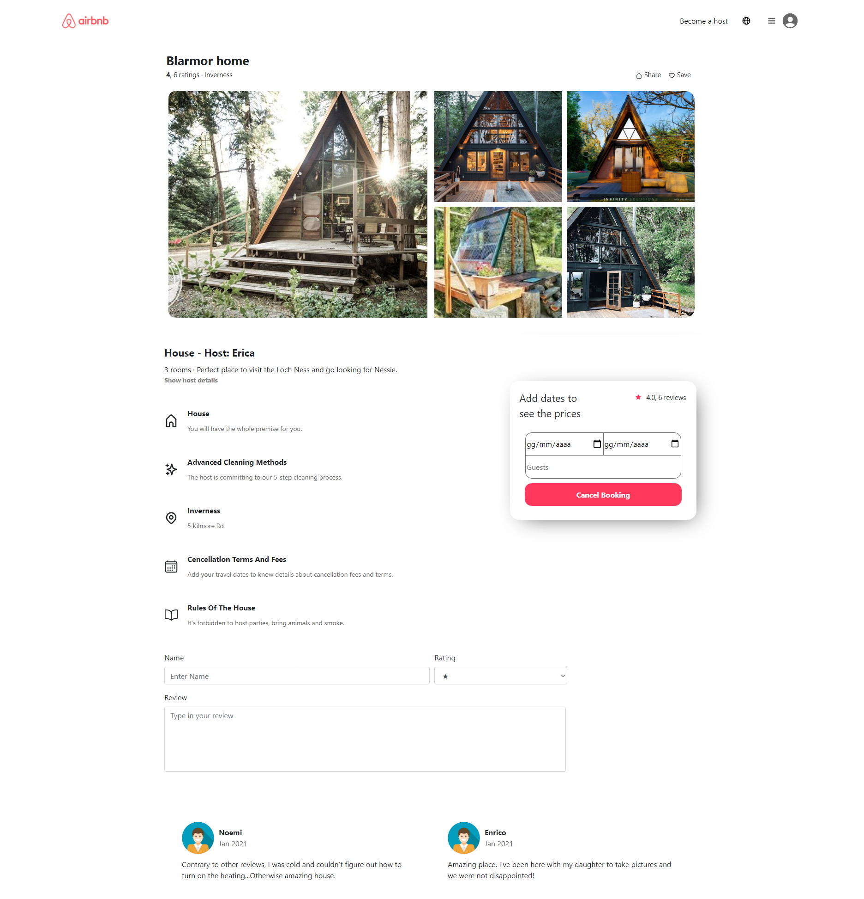

# CLONE DI AirBnB
## Build Week 2 - Bootstrap e CSS Avanzato

_L'obbiettivo di questa build week è creare una copia dell'interfaccia del sito di AirBnB._

### Impostazione del lavoro

**Gruppo di lavoro n. 6**

1. Mattia Petruzzi
2. Gianluca Chiaravalloti
3. Francesca Montini
4. Marina Greco

**Pagine da creare:**
* Pagina di benvenuto;
* Pagina di lista degli appartamenti;
* Pagina singolo appartamento;

Gestire le versioni mobile, tablet e desktop.

### Mockup da eseguire:
#### Pagina index.html

#### Pagina lista appartamenti

#### Pagina singolo appartamento

